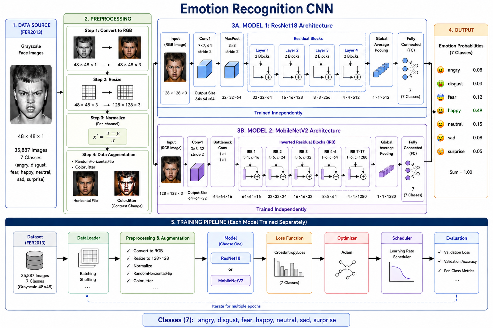
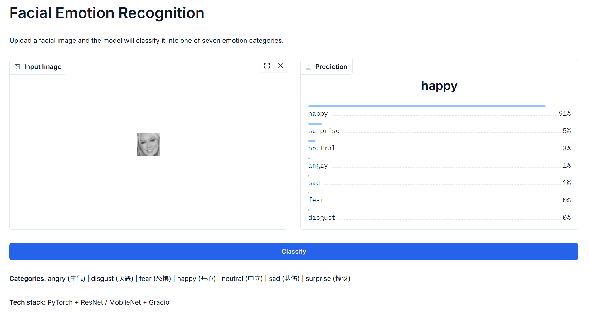

# Emotion Recognition CNN

## 项目概述

基于深度学习的人脸情绪识别系统，使用 FER2013 数据集训练卷积神经网络模型（ResNet18 与 MobileNetV2），对人脸图像中的情绪进行分类，支持 7 类情绪识别：angry（生气）、disgust（厌恶）、fear（恐惧）、happy（开心）、neutral（中立）、sad（悲伤）、surprise（惊讶）。

项目包含了数据预处理、模型训练、模型评估以及 Web Demo 部署等完整流程，基于 PyTorch 实现。

## 模型设计

### 模型架构

本项目实现了两种常见 CNN 网络用于情绪识别任务：

1. **ResNet18**: 基于残差网络的 18 层深度卷积网络，具有较好的特征提取能力。

2. **MobileNetV2**: 轻量级卷积网络，采用深度可分离卷积和倒置残差结构



### 关键特性

- **输入尺寸**: 128×128 RGB 图像
- **输出类别**: 7 种情绪类别
- **预训练权重**: 支持 ImageNet 预训练权重
- **数据增强**: 对训练集图像进行随机翻转和对比度调整，提升模型泛化能力

## 模型训练

支持分别训练 ResNet 和 MobileNetV2：

```bash
# 训练 ResNet18
python scripts/train.py --model resnet --epochs 20 --batch_size 32

# 训练 MobileNetV2
python scripts/train.py --model mobilenet --epochs 20 --batch_size 32
```

### 训练参数

- **训练轮次**: 20
- **批次大小**: 32
- **优化器**: Adam (lr=3e-4, weight_decay=5e-4)
- **损失函数**: CrossEntropyLoss
- **学习率调度**: 可选 CosineAnnealingLR

### 模型保存

- 最佳模型保存至: `checkpoints/{model}/best_model.pth`
- 训练历史保存至: `checkpoints/{model}/history.json`

## 实验结果

### 性能对比

| 模型 | Accuracy | Precision | Recall | F1 Score |
|------|-----------|--------|--------|---------|
| ResNet18 | 65.45% | 65.07% | 65.45% | 65.21% |
| MobileNetV2 | 66.04% | 66.29% | 66.04% | 65.64% |

整体上，两种模型表现接近。

### 按类别性能指标

#### ResNet18 模型

| 情绪类别 | Precision | Recall | F1 Score | 支持样本数 |
|----------|--------|--------|---------|------------|
| angry | 0.59 | 0.57 | 0.58 | 467 |
| disgust | 0.75 | 0.59 | 0.66 | 56 |
| fear | 0.49 | 0.45 | 0.47 | 496 |
| happy | 0.83 | 0.87 | 0.85 | 895 |
| neutral | 0.55 | 0.56 | 0.55 | 653 |
| sad | 0.78 | 0.79 | 0.78 | 415 |
| surprise | 0.59 | 0.59 | 0.59 | 607 |

#### MobileNetV2 模型

| 情绪类别 | 精确率 | 召回率 | F1 分数 | 支持样本数 |
|----------|--------|--------|---------|------------|
| angry | 0.58 | 0.63 | 0.60 | 467 |
| disgust | 0.68 | 0.48 | 0.56 | 56 |
| fear | 0.56 | 0.36 | 0.44 | 496 |
| happy | 0.87 | 0.85 | 0.86 | 895 |
| neutral | 0.55 | 0.53 | 0.54 | 653 |
| sad | 0.77 | 0.81 | 0.79 | 415 |
| surprise | 0.54 | 0.70 | 0.61 | 607 |

#### 分类结果分析

从各类别指标可以看出：

- `happy` 类别识别效果最好，F1 分数达到 0.85 以上
- `fear` 类别识别准确率较低，容易与 `sad`、`neutral` 等类别混淆
- `disgust` 测试集中类别样本数量较少(仅 56 张)，指标波动较明显

## Web Demo

项目提供基于 Gradio 的 Web 应用，用于单张图片情绪识别.



## 安装与运行

### 安装依赖

```bash
# 安装依赖
pip install -r requirements.txt
```

### 完整流程

1. **数据集下载**：从[魔搭社区](https://www.modelscope.cn/datasets/ly261666/Fer2013/files)下载 FER2013 数据集并放置在 `data/raw/fer2013.csv`

1. **数据转换**:
   ```bash
   # 将数据集转换成图片并划分tarin、val、test
   python -m scripts.prepare_data
   ```

2. **训练模型**:
   ```bash
   python -m scripts.train --model resnet
   python -m scripts.train --model mobilenet
   ```

2. **绘制训练曲线(loss 和 accuracy 曲线图)**:
   ```bash
   python -m scripts.plot_curves
   ```

3. **评估模型**:
   ```bash
   python -m scripts.evaluate --model resnet
   python -m scripts.evaluate --model mobilenet
   ```

5. **启动 Web 应用**:
   ```bash
   python app/app.py
   ```

### 项目结构

```
emotion-recognition-cnn/
├── data/                     # 数据相关
│   ├── raw/                  # 原始数据
│   └── processed/            # 转换数据
├── models/                   # 模型定义
│   ├── resnet.py
│   ├── mobilenet.py
│   └── __init__.py
├── configs/                  # 配置文件
├── scripts/                  # 核心脚本
│   ├── prepare_data.py       # 数据转换
│   ├── train.py              # 训练
│   ├── evaluate.py           # 评估
│   └── plot_curves.py        # 绘图
├── utils/                    # 工具函数
│   ├── dataset.py            # 数据加载
│   └── transforms.py         # 数据增强
├── checkpoints/              # 模型权重
├── results/                  # 实验结果
├── app/                      # Web 应用
│   └── app.py                # Gradio 应用
├── requirements.txt          # 依赖
└── README.md                 # 项目文档
```